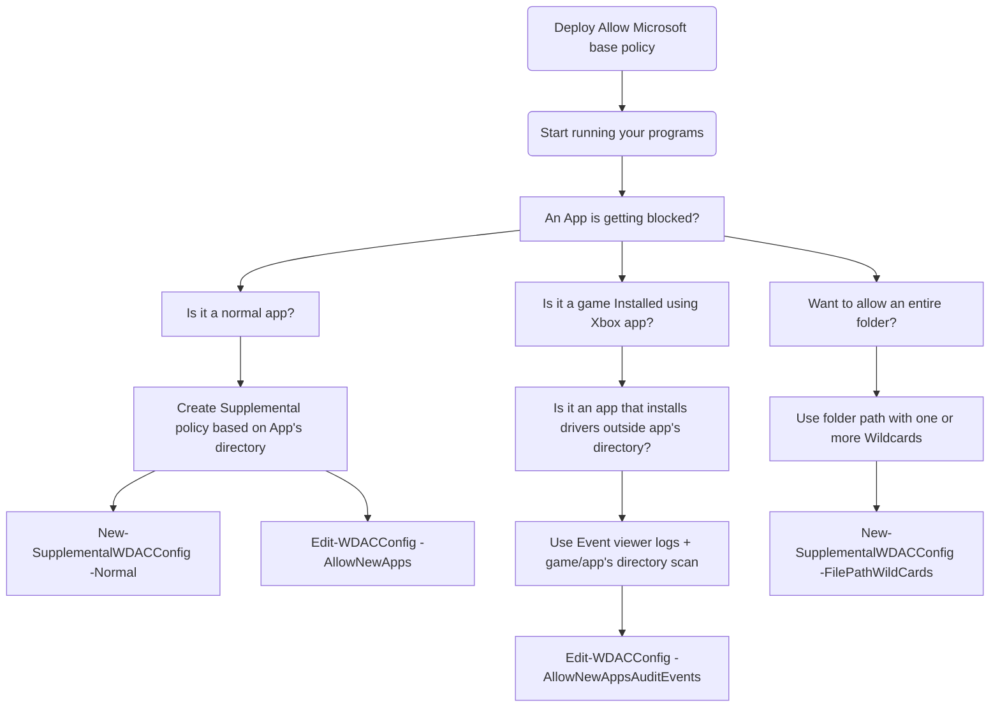
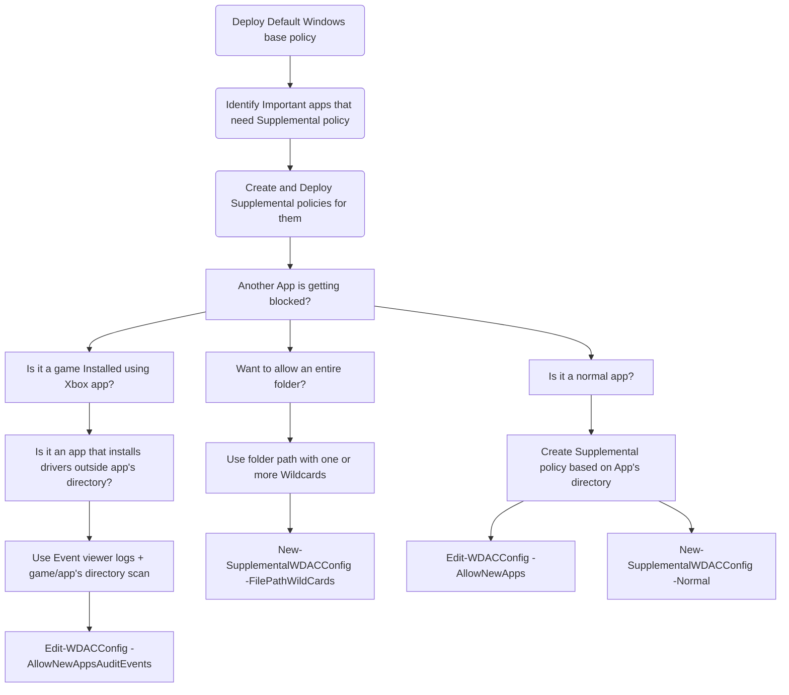

# WDAC policy for Fully Managed device - Variant 1

<div align="center">

| Base policy type|Method used|Signed | Protection score 1-5 |
| :-------------: | :-------------: | :-------------: | :-------------: |
| Allow Microsoft / Default Windows | [WDACConfig module](https://github.com/HotCakeX/Harden-Windows-Security/wiki/WDACConfig) | No | 4 |

</div>

<br>


<br>

## Video Guide

<a href="https://youtu.be/KD0zUb2GCyk?si=_g09D0yF5lTN1NLO"></a>

<br>

* This variant helps you create and deploy a WDAC policy for fully managed device ***using only Event Viewer audit logs.***

* This scenario includes using explicit Allow rules for files and certificates/singers, anything not allowed by the policies we are going to make are automatically denied/blocked.

<br>


<br>

## Prepare a Virtual Machine

Install Hyper-V role from optional Windows features if you haven't already.

```powershell
Enable-WindowsOptionalFeature -Online -FeatureName Containers-DisposableClientVM -All -norestart
```

<br>

Download the latest Windows `.ISO` file [from Microsoft website](https://www.microsoft.com/software-download/), create a new VM with it, install Windows and log in. Fully update Windows and then restart to apply the updates. You can create a Hyper-V checkpoint at this point so that you can return back to this clean state later on if you need to.

<br>


<br>

## Prepare a Base policy

There are 2 types of base policies you can choose from.

1. Allow Microsoft: Allows only files and apps that are signed by Microsoft's trusted root certificates.

2. Default Windows: Allows only files and apps that come pre-installed by Windows.

<br>

### Deploy the Allow Microsoft Prep mode base policy

```powershell
New-WDACConfig -PrepMSFTOnlyAudit -LogSize 10MB -Deploy
```

* [Parameter Info](https://github.com/HotCakeX/Harden-Windows-Security/wiki/New-WDACConfig#new-wdacconfig--prepmsftonlyaudit)

<br>

### Deploy the Default Windows Prep mode base policy

```powershell
New-WDACConfig -PrepDefaultWindowsAudit -LogSize 10MB -Deploy
```

* [Parameter Info](https://github.com/HotCakeX/Harden-Windows-Security/wiki/New-WDACConfig#new-wdacconfig--prepdefaultwindowsaudit)

<br>

Depending on whichever of the option you choose, it deploys the base policy in audit mode. No reboot required.

<br>


<br>

## Generate Audit Event Logs on the System

Install all of the programs that you want to allow in the WDAC policy, on the VM. These are the programs that you want to allow to run and be installed on the target system once you've deployed the WDAC policy.

* Installing or running 3rd party non-Microsoft programs, while ***Allow Microsoft*** policy in Audit mode is deployed on the VM, generates event logs for each of the programs and their files.

* Installing or running any program that doesn't come pre-installed by default with Windows, while **Default Windows** policy in Audit mode is deployed on the VM, generates event logs for each of the programs and their files.

These event logs are exactly what we need to identify and create Allow rules for the detected files.

Only files that are executed during Prep mode phase generate event logs, so by simply installing a program using its installer, we can't trigger event log generation for each of the components and executables that each program has. So, after installing the programs, run them, use them a bit as you normally would so that all of the programs' components are executed and event logs generated for them.

<br>


<br>

## Generate Supplemental Policy From the Audit Event Logs

### If you chose the Allow Microsoft path

```powershell
New-WDACConfig -MakePolicyFromAuditLogs -BasePolicyType 'Allow Microsoft Base' -NoDeletedFiles
```

* [Parameter Info](https://github.com/HotCakeX/Harden-Windows-Security/wiki/New-WDACConfig#new-wdacconfig--makepolicyfromauditlogs)

<br>

### If you chose the Default Windows path

```powershell
New-WDACConfig -MakePolicyFromAuditLogs -BasePolicyType 'Default Windows Base' -NoDeletedFiles
```

* [Parameter Info](https://github.com/HotCakeX/Harden-Windows-Security/wiki/New-WDACConfig#new-wdacconfig--makepolicyfromauditlogs)

<br>

All of the outputs are saved in a folder named "WDAC" inside the current working directory.

**If you use the `-Deploy` optional switch parameter with the commands above, 3 things will automatically happen:**

1. The deployed Prep mode base policy will be removed.
2. The actual base policy will be deployed depending on whichever you choose.
3. The Supplemental policy generated from Audit logs will be deployed.

<br>

If you don't use the `-Deploy` switch, you can deploy the `.cip` binary files manually using [CITool](https://learn.microsoft.com/en-us/windows/security/application-security/application-control/windows-defender-application-control/operations/citool-commands).

[More info on deployment](https://learn.microsoft.com/en-us/windows/security/application-security/application-control/windows-defender-application-control/deployment/wdac-deployment-guide)

[**Information about how to Sign and Deploy a Signed WDAC policy.**](https://github.com/HotCakeX/Harden-Windows-Security/wiki/How-to-Create-and-Deploy-a-Signed-WDAC-Policy-Windows-Defender-Application-Control)

<br>


<br>



<br>


<br>



<br>
