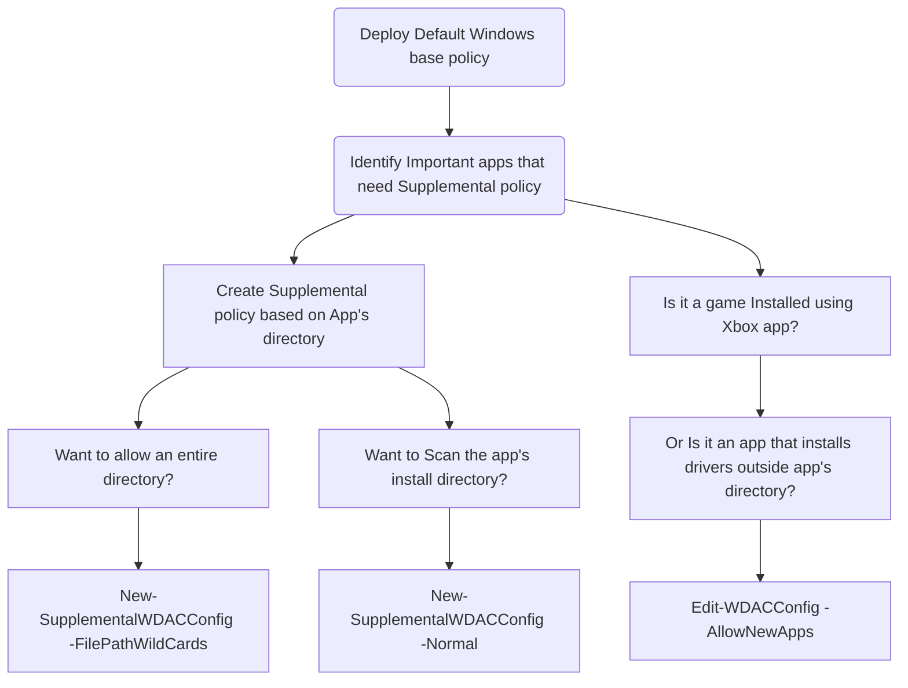

# WDAC policy for Fully managed device - Variant 2

<div align="center">

| Base policy type|Method used|Signed | Protection score 1-5 |
| :-------------: | :-------------: | :-------------: | :-------------: |
| Default Windows | [WDACConfig module](https://github.com/HotCakeX/Harden-Windows-Security/wiki/WDACConfig) | No | 4 |

</div>

<br>



> [!NOTE]\
> *Every time I use the word "App", I'm referring to regular Win32 programs as well as Microsoft Store installed apps; Basically, any software that you can run.*
>
> This scenario provides a very high protection level. Using the WDACConfig module, it's very easy to deploy, manage and maintain a system with this configuration.

<br>


<br>

## Deploy the Default Windows Base Policy on the System

Start by deploying the Default Windows base policy on the system, which allows only files and apps that come pre-installed in Windows to run and anything else is blocked.

Since this is an unsigned policy, no reboot is required but it's better to perform a reboot if you want the currently running non-Windows apps to stop running.

<br>

```powershell
New-WDACConfig -PolicyType DefaultWindows -Deploy
```

* [Cmdlet info](https://github.com/HotCakeX/Harden-Windows-Security/wiki/New-WDACConfig)

After deploying the base policy, you can create Supplemental policies to allow other apps that don't come by default with Windows to run. To do that, you have multiple options.

<br>


<br>

## Creating Supplemental Policy for Apps Already Installed

If you deployed the Default Windows base policy on a system that already had apps installed, you can create Supplemental policy for them using the following syntaxes:

### Based on Signer Rules, Hashes, File Names Etc.

```powershell
New-SupplementalWDACConfig -Normal -ScanLocation "C:\Program Files\Program" -SuppPolicyName "App's Name" -PolicyPath "C:\DefaultWindowsPlusBlockRules.xml" -Deploy
```

* [Parameter info](https://github.com/HotCakeX/Harden-Windows-Security/wiki/New-SupplementalWDACConfig#new-supplementalwdacconfig--normal)

<br>

### Based on File Path With One or More Wildcard Characters

```powershell
New-SupplementalWDACConfig -FilePathWildCards -WildCardPath "C:\Program Files\Program\*" -SuppPolicyName "App's Name" -PolicyPath
"C:\DefaultWindowsPlusBlockRules.xml" -Deploy
```

* [Parameter info](https://github.com/HotCakeX/Harden-Windows-Security/wiki/New-SupplementalWDACConfig#new-supplementalwdacconfig--filepathwildcards)

<br>

### Based on an Installed Windows App’s Name

```powershell
New-SupplementalWDACConfig -InstalledAppXPackages -PackageName "*App's name*" -SuppPolicyName "App's name" -PolicyPath "C:\DefaultWindowsPlusBlockRules.xml" -Deploy
```

* [Parameter info](https://github.com/HotCakeX/Harden-Windows-Security/wiki/New-SupplementalWDACConfig#new-supplementalwdacconfig--installedappxpackages)

<br>


<br>

## Creating Supplemental Policy for New App Installations or Apps Already Installed

If the app you are trying to allow isn't installed and when you try to install it you see a blocked/error message, you can use the following syntaxes to allow them to run and then automatically create Supplemental policy for them.

These methods also work for apps that were installed prior to deploying the Default Windows base policy and now you want to allow them to run by creating Supplemental policy for them.

You can create a Supplemental policy for more than 1 app at a time by browsing for multiple apps' install directories using the commands below.

### Based on App’s Install Directory and Other Signals

```powershell
Edit-WDACConfig -AllowNewApps -SuppPolicyName "App's Name" -PolicyPath "C:\DefaultWindowsPlusBlockRules.xml"
```

* [Parameter info](https://github.com/HotCakeX/Harden-Windows-Security/wiki/Edit-WDACConfig#edit-wdacconfig--allownewapps)

<br>


<br>

## What to Do When There Is an Update for an Allowed App?

If you've created a Supplemental policy for an app that is already installed and now there is a newer version of that app available, you have multiple options:

1. If the Supplemental policy that you created to allow that app is based on FilePath with wildcards, then the app can be updated and no change in policy is required.

2. If the Supplemental policy is based on [PFN (Package Family Name)](https://learn.microsoft.com/en-us/windows/security/application-security/application-control/app-control-for-business/design/manage-packaged-apps-with-appcontrol) of the app, available only for apps that use [MSIX](https://learn.microsoft.com/en-us/windows/msix/overview) installers, like some of the modern apps installed through Microsoft Store, then you don't need to take any action and the app will be updated without any issues.

3. If the Supplemental policy is only based on the app's digital signature, which is common for well-made apps, then you don't need to take any further action. As long as the new version of the app has the same digital signature / developer identity, then it will be allowed to run.

4. If the Supplemental policy is based on individual File Paths (in contrast to wildcard FilePath rules), or based on [FileName rules](https://learn.microsoft.com/en-us/windows/security/application-security/application-control/app-control-for-business/design/select-types-of-rules-to-create#table-3--specificfilenamelevel-options), then most likely there is no need for any further action to be taken as long as the new app's version uses the same file names or the same file paths for its components.

5. If the Supplemental policy is based on Hash of the app's files, either partially (mixed with signer rules) or entirely (for apps without any digital identity/signature) then all you have to do is to remove the deployed Supplemental policy and create a new Supplemental policy for the app using live audit mode in the module as explained above. Don't need to reboot immediately, but to finish the removal process of a Supplemental policy, whether it's signed or unsigned, a reboot will be eventually needed.

<br>
