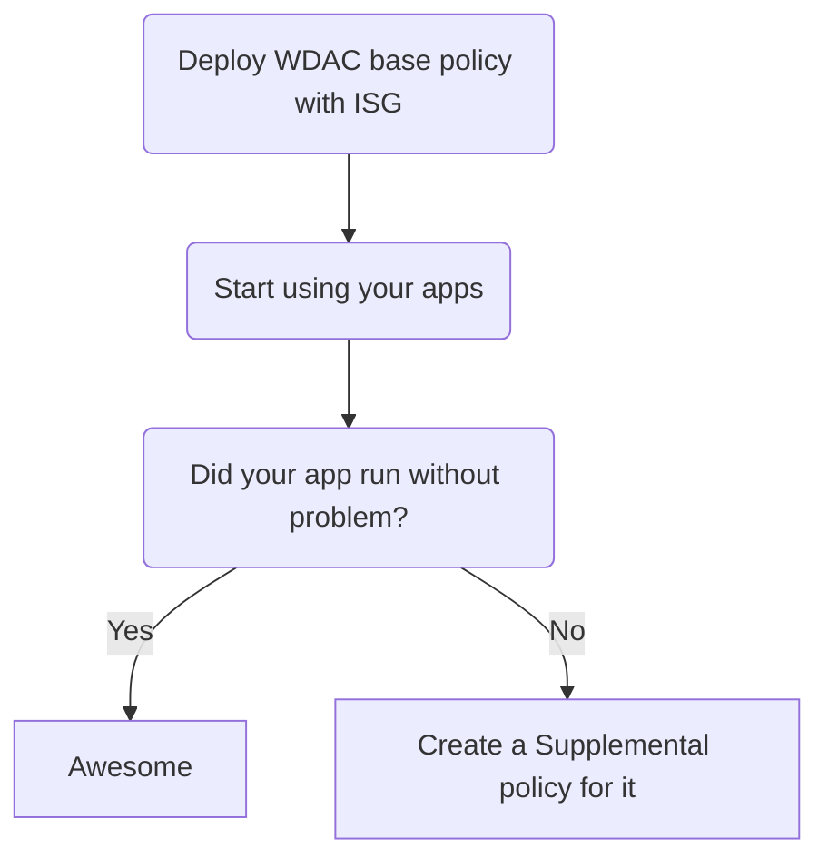

# WDAC policy for Lightly managed device

<div align="center">

| Base policy type|Method used|Signed | Protection score 1-5 |
| :-------------: | :-------------: | :-------------: | :-------------: |
| [Signed and Reputable (ISG)](https://learn.microsoft.com/en-us/windows/security/application-security/application-control/windows-defender-application-control/design/use-wdac-with-intelligent-security-graph#configuring-isg-authorization-for-your-wdac-policy) | [WDACConfig module](https://github.com/HotCakeX/Harden-Windows-Security/wiki/WDACConfig) | No / Yes | 3.5 / 4 |

</div>

<br>



<br>


<br>

## Video Guide

<a href="https://youtu.be/RgVf4p9ct90?si=mGdVCnqVlUN_FBWR"></a>

<br>

*Every time I use the word "App", I'm referring to regular Win32 programs as well as Microsoft Store installed apps; Basically any software that you can run.*

This scenario provides a high protection level, ***higher if you cryptographically Sign it***. Using the WDACConfig module, it's very easy to deploy, manage and maintain a system with this configuration.

<br>


<br>

## Deploy the Signed and Reputable base policy on the system

Start by deploying the Signed and Reputable base policy on the system, which allows only files and apps that are authorized by the [Intelligent Security Graph Authorization](https://learn.microsoft.com/en-us/windows/security/application-security/application-control/windows-defender-application-control/design/use-wdac-with-intelligent-security-graph) which have known good state to run and anything else is blocked.

### Unsigned version

```powershell
New-WDACConfig -MakeLightPolicy -Deploy
```

* [Parameter info](https://github.com/HotCakeX/Harden-Windows-Security/wiki/New-WDACConfig#new-wdacconfig--makelightpolicy)

<br>

### Signed version

```powershell
New-WDACConfig -MakeLightPolicy
```

* [Parameter info](https://github.com/HotCakeX/Harden-Windows-Security/wiki/New-WDACConfig#new-wdacconfig--makelightpolicy)

```powershell
Deploy-SignedWDACConfig -CertPath "C:\Certificate.cer" -PolicyPaths "C:\Users\HotCakeX\SignedAndReputable.xml" -CertCN "WDAC Certificate" -Deploy
```

* [Cmdlet info](https://github.com/HotCakeX/Harden-Windows-Security/wiki/Deploy-SignedWDACConfig)

<br>

* The module creates ***Signed and Reputable WDAC base Policy*** based on [AllowMicrosoft policy template](https://learn.microsoft.com/en-us/windows/security/application-security/application-control/windows-defender-application-control/design/example-wdac-base-policies) with ***ISG*** related [rule options](https://learn.microsoft.com/en-us/windows/security/application-security/application-control/windows-defender-application-control/design/select-types-of-rules-to-create#table-1-windows-defender-application-control-policy---policy-rule-options), then merges [Microsoft recommended block rules](https://learn.microsoft.com/en-us/windows/security/application-security/application-control/windows-defender-application-control/design/applications-that-can-bypass-wdac) with it. We don't merge [Microsoft recommended ***driver*** block rules](https://learn.microsoft.com/en-us/windows/security/application-security/application-control/windows-defender-application-control/design/microsoft-recommended-driver-block-rules) because it is already enabled by default in Windows.

* The module also automatically starts the [Application Identity](https://learn.microsoft.com/en-us/windows/security/application-security/application-control/windows-defender-application-control/applocker/configure-the-application-identity-service) (`AppIDSvc`) service required for [ISG Authorization](https://learn.microsoft.com/en-us/windows/security/application-security/application-control/windows-defender-application-control/design/use-wdac-with-intelligent-security-graph#enable-the-necessary-services-to-allow-wdac-to-use-the-isg-correctly-on-the-client) and sets its startup mode to Automatic. It's a protected service so can't be disabled or modified using Services snap-in.

* ISG Authorization requires active Internet connection to communicate with the global ISG network.

* Recommended to perform a reboot regardless of whether you are deploying signed or unsigned version of the "Signed and Reputable" WDAC base policy.

<br>

After finishing deploying the Signed and Reputable base policy, if there is an app that is getting blocked and you want to allow it, you can create Supplemental policies to expand your base policy. To do that, you have multiple options.

<br>


<br>

## Creating Supplemental policy for apps already installed

The following commands use the `-Deploy` optional switch parameter, meaning after Supplemental policy creation, they are automatically deployed on the system.

  * If you chose the Signed path, omit it from the commands and instead use the [Deploy-SignedWDACConfig](https://github.com/HotCakeX/Harden-Windows-Security/wiki/Deploy-SignedWDACConfig) cmdlet to Sign and Deploy the Supplemental policy xml files.

### Based on signer rules, hashes, file names etc.

```powershell
New-SupplementalWDACConfig -Normal -ScanLocation "C:\Program Files\Program" -SuppPolicyName "App's Name" -PolicyPath "C:\SignedAndReputable.xml" -Deploy
```

* [Parameter info](https://github.com/HotCakeX/Harden-Windows-Security/wiki/New-SupplementalWDACConfig#new-supplementalwdacconfig--normal)

<br>

### Based on File path with one or more wildcard characters

```powershell
New-SupplementalWDACConfig -FilePathWildCards -WildCardPath "C:\Program Files\Program\*" -SuppPolicyName "App's Name" -PolicyPath
"C:\SignedAndReputable.xml" -Deploy
```

* [Parameter info](https://github.com/HotCakeX/Harden-Windows-Security/wiki/New-SupplementalWDACConfig#new-supplementalwdacconfig--filepathwildcards)

<br>

### Based on an installed Windows app's name

```powershell
New-SupplementalWDACConfig -InstalledAppXPackages -PackageName "*App's name*" -SuppPolicyName "App's name" -PolicyPath "C:\SignedAndReputable.xml" -Deploy
```

* [Parameter info](https://github.com/HotCakeX/Harden-Windows-Security/wiki/New-SupplementalWDACConfig#new-supplementalwdacconfig--installedappxpackages)

<br>


<br>

## Creating Supplemental policy for new app installations or apps already installed

If the app you are trying to allow isn't installed, and when you try to install it you see a blocked/error message, you can use the following syntaxes to allow them to run and then automatically create Supplemental policy for them.

These methods also work for apps that were installed prior to deploying the "Signed and Reputable" base policy and now you want to allow them to run by creating Supplemental policy for them.

You can create a Supplemental policy for more than 1 app at a time by browsing for multiple apps' install directories using the commands below.

<br>

### Based on App's install directory and Event viewer logs - Unsigned version

```powershell
Edit-WDACConfig -AllowNewAppsAuditEvents -SuppPolicyName "App's Name" -PolicyPath "C:\SignedAndReputable.xml" -LogSize 20MB
```

* [Parameter info](https://github.com/HotCakeX/Harden-Windows-Security/wiki/Edit-WDACConfig#edit-wdacconfig--allownewappsauditevents)

### Based on App's install directory only - Unsigned version

```powershell
Edit-WDACConfig -AllowNewApps -SuppPolicyName "App's Name" -PolicyPath "C:\SignedAndReputable.xml"
```

* [Parameter info](https://github.com/HotCakeX/Harden-Windows-Security/wiki/Edit-WDACConfig#edit-wdacconfig--allownewapps)

<br>

### Based on App's install directory and Event viewer logs - Signed version

```powershell
Edit-SignedWDACConfig -AllowNewAppsAuditEvents -CertPath "C:\Certificate.cer" -SuppPolicyName "App's Name" -PolicyPath "C:\SignedAndReputable.xml" -CertCN "WDAC Certificate" -LogSize 20MB
```

* [Parameter info](https://github.com/HotCakeX/Harden-Windows-Security/wiki/Edit-SignedWDACConfig#edit-signedwdacconfig--allownewappsauditevents)

### Based on App's install directory only - Signed version

```powershell
Edit-SignedWDACConfig -AllowNewApps -CertPath "C:\Certificate.cer" -SuppPolicyName "App's Name" -PolicyPath "C:\SignedAndReputable.xml" -CertCN "WDAC Certificate"
```

* [Parameter info](https://github.com/HotCakeX/Harden-Windows-Security/wiki/Edit-SignedWDACConfig#edit-signedwdacconfig--allownewapps)

<br>


<br>

## What to Do if You Have a Lot of Supplemental Policies?

Currently, the limit for the number of policies (Base + Supplemental) that can be deployed on a system at a time is 32. So if you are getting close to that limit, you can merge some or all of your Supplemental policies automatically into 1 using the command below:

### Unsigned version

```powershell
Edit-WDACConfig -MergeSupplementalPolicies -SuppPolicyName "Merge of Multiple Supplementals" -PolicyPath "C:\SignedAndReputable.xml" -SuppPolicyPaths "C:\Supplemental policy for App1.xml","C:\Supplemental policy for App 2.xml","C:\Supplemental policy for App 3.xml"
```

* [Parameter info](https://github.com/HotCakeX/Harden-Windows-Security/wiki/Edit-WDACConfig#edit-wdacconfig--mergesupplementalpolicies)

<br>

### Signed version

```powershell
Edit-SignedWDACConfig -MergeSupplementalPolicies -CertPath "C:\Certificate.cer" -SuppPolicyName "Merge of Multiple Supplementals" -PolicyPath "C:\SignedAndReputable.xml" -CertCN "WDAC Certificate" -SuppPolicyPaths "C:\Supplemental policy for App1.xml","C:\Supplemental policy for App 2.xml","C:\Supplemental policy for App 3.xml"
```

* [Parameter info](https://github.com/HotCakeX/Harden-Windows-Security/wiki/Edit-SignedWDACConfig#edit-signedwdacconfig--mergesupplementalpolicies)

<br>


<br>

## Security Considerations

One of the differences between using **ISG in a WDAC policy** vs using **Smart App Control** (which also use ISG) is that WDAC policy + ISG rule option passes along reputation from app installers to the binaries they write to disk, it can over-authorize files in some cases. For example, if the installer launches the app upon completion, any files the app writes during that first run will also be allowed.

Smart App Control however doesn't do this, it will trust the installer file itself if it's trustworthy and subsequently checks the trustworthiness of any binaries the installer tries to use and write to the disk, if any of those binaries or components can't be verified or are malicious, they get blocked.

Explained more in here:

* [Security considerations with the ISG option](https://learn.microsoft.com/en-us/windows/security/application-security/application-control/windows-defender-application-control/design/use-wdac-with-intelligent-security-graph#security-considerations-with-the-isg-option)

* [Smart app control has blocked part of this app](https://support.microsoft.com/en-us/topic/smart-app-control-has-blocked-part-of-this-app-0729fff1-48bf-4b25-aa97-632fe55ccca2)

<br>


<br>

## What to Do When There Is an Update for an Allowed App?

If you've created a Supplemental policy for an app that is already installed and now there is a newer version of that app available, you have multiple options:

1. If the Supplemental policy that you created to allow that app is based on FilePath with wildcards, then the app can be updated and no change in policy is required.

2. If the Supplemental policy is based on [PFN (Package Family Name)](https://learn.microsoft.com/en-us/windows/security/application-security/application-control/windows-defender-application-control/design/manage-packaged-apps-with-wdac) of the app, available only for apps that use [MSIX](https://learn.microsoft.com/en-us/windows/msix/overview) installers, like some of the modern apps installed through Microsoft Store, then you don't need to take any action and the app will be updated without any issues.

3. If the Supplemental policy is only based on the app's digital signature, which is common for well-made apps, then you don't need to take any further action. As long as the new version of the app has the same digital signature / developer identity, then it will be allowed to run.

4. If the Supplemental policy is based on individual File Paths (in contrast to wildcard FilePath rules), or based on [FileName rules](https://learn.microsoft.com/en-us/windows/security/application-security/application-control/windows-defender-application-control/design/select-types-of-rules-to-create#table-3-windows-defender-application-control-policy---filename-levels), then most likely there is no need for any further action to be taken as long as the new app's version uses the same file names or the same file paths for its components.

5. If the Supplemental policy is based on Hash of the app's files, either partially (mixed with signer rules) or entirely (for apps without any digital identity/signature) then all you have to do is to remove the deployed Supplemental policy and create a new Supplemental policy for the app using live audit mode in the module as explained above. Don't need to reboot immediately, but to finish the removal process of a Supplemental policy, whether it's signed or unsigned, a reboot will be eventually needed.

<br>
